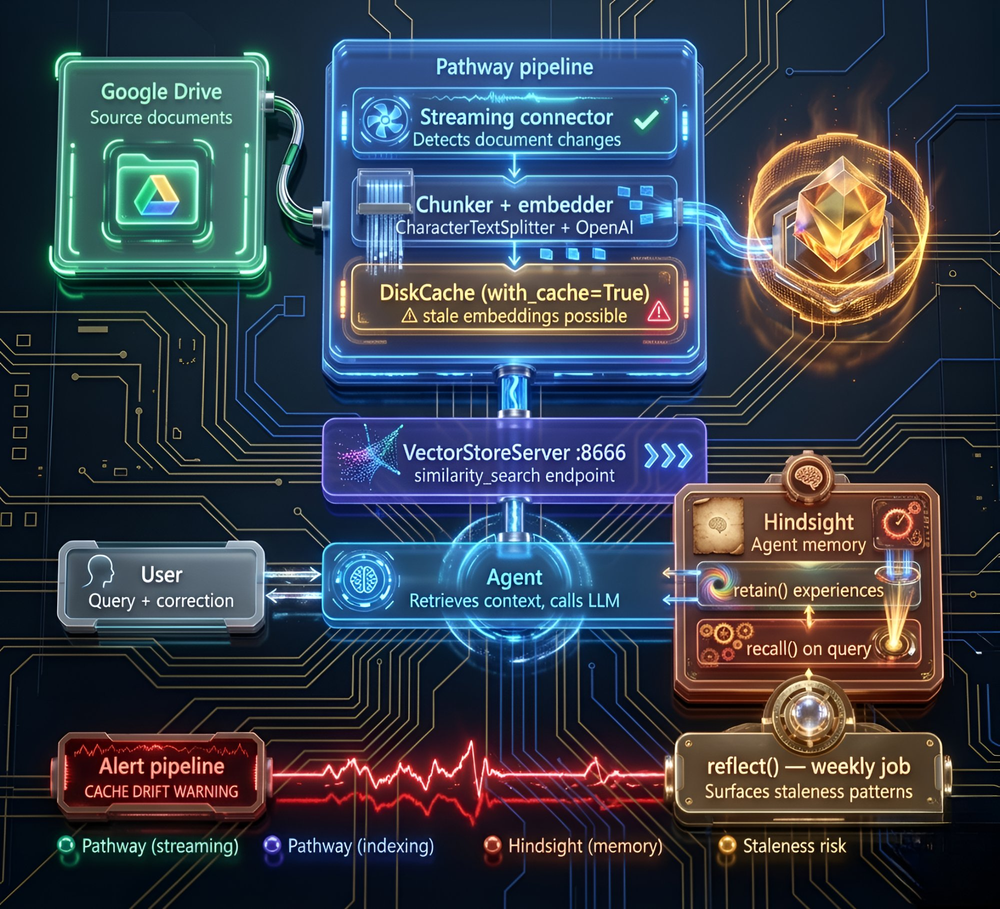

# Hindsight Showed My Pathway RAG Pipeline Was Silently Stale

Nothing in the system was technically wrong.

The pipeline was streaming. Pathway was incrementally indexing. Queries were returning with low latency and consistent results. From every observable metric, the system looked healthy.

And yet the agent kept answering with information that had already been replaced.

At first, it didn't feel like a system issue. The responses were coherent, well-structured, and grounded in retrieved context. But something was off. Subtly off. The kind of wrong that doesn't break anything — it just erodes trust over time.

By the time we noticed the pattern, the source of truth had already moved on multiple times. Documents had been updated, schemas had changed, configs had evolved. Pathway had processed all of it. The agent hadn't.

---

## The System We Thought We Built

The architecture was designed to be "real-time" in the way most modern RAG pipelines aim to be.

Source documents lived in a Google Drive folder — specs, internal runbooks, API references. We had streaming connectors feeding data into [Pathway](https://github.com/pathwaycom/pathway). Incremental indexing ensured that only changes were processed. The retrieval layer sat cleanly on top, and an agent orchestrated responses using the latest available context.

On paper: continuous ingestion, incremental updates, low-latency retrieval, consistent responses. We weren't polling. We weren't rebuilding indexes from scratch. Everything was designed to evolve with the data.



The setup looked like this:

```python
import pathway as pw
from pathway.xpacks.llm.vector_store import VectorStoreServer
from langchain_openai import OpenAIEmbeddings
from langchain.text_splitter import CharacterTextSplitter

data = pw.io.gdrive.read(
    object_id="<folder-id>",
    service_user_credentials_file="credentials.json",
    with_metadata=True,
    mode="streaming",
)

embeddings = OpenAIEmbeddings(api_key=os.environ["OPENAI_API_KEY"])
splitter = CharacterTextSplitter(chunk_size=1000, chunk_overlap=100)

server = VectorStoreServer.from_langchain_components(
    data,
    embedder=embeddings,
    splitter=splitter,
)

# This line is where the problem was hiding
server.run_server(
    host="0.0.0.0",
    port=8666,
    with_cache=True,
    cache_backend=pw.persistence.Backend.filesystem("./Cache"),
    threaded=True,
)
```

We added [Hindsight](https://github.com/vectorize-io/hindsight) as the agent's long-term memory layer. Every interaction — the question asked, what the agent retrieved, what it answered, and whether the user pushed back — got retained into a Hindsight memory bank. The idea was that the agent should learn over time: which retrieval patterns worked, which answers got corrected, where it kept going wrong.

Here's how we wired Hindsight into the agent loop:

```python
from hindsight_client import Hindsight

memory = Hindsight(base_url="http://localhost:8888")
BANK = "rag-agent-v1"

def answer_question(user_query: str) -> str:
    # Pull relevant past experiences before answering
    past_experience = memory.recall(
        bank_id=BANK,
        query=user_query,
    )

    # Retrieve from live Pathway index
    docs = vector_client.similarity_search(user_query, k=5)
    context = "\n\n".join(d.page_content for d in docs)

    # Generate answer with both retrieved context and past experience
    answer = call_llm(user_query, context, past_experience)

    # Retain this interaction as an experience
    memory.retain(
        bank_id=BANK,
        content=f"Q: {user_query}\nRetrieved: {context[:500]}\nAnswered: {answer}",
    )

    return answer
```

Pathway gives the agent current documents. Hindsight gives it memory of what happened in past interactions. Together, they were supposed to make the agent both accurate and consistent.

What we didn't expect was that Hindsight would become the first place we saw evidence of a bug deep in the indexing pipeline.

---

## The Failure That Didn't Look Like One

The pipeline wasn't missing updates.

Pathway's differential dataflow was doing its job — detecting document changes, propagating updates, and triggering re-indexing exactly as expected. The issue lived in a place we weren't actively questioning: the embedder.

At the center of the pipeline sat a user-defined function responsible for generating embeddings. Like many production setups, it was configured with a persistent cache:

```yaml
cache_strategy: !pw.udfs.DiskCache
```

The reasoning was straightforward. Embeddings are expensive to compute, and caching them avoids redundant work when documents don't change. But in this case, documents *were* changing — and yet the embedder wasn't recomputing anything.

Instead, the cache intercepted the embedding calls and returned previously stored vectors — embeddings generated from an earlier version of the document. This created a subtle but critical inconsistency:

- The documents were fresh
- The index updates had been triggered
- But the embeddings were stale

Which meant the system's understanding of the data no longer matched the data itself.

---

## When Correct Systems Produce Wrong Answers

From an infrastructure perspective, everything was functioning correctly. The ingestion layer was up-to-date. The indexing pipeline was processing changes. The retrieval layer was returning results without error.

But retrieval is only as good as the representations it operates on. The embeddings — the layer that actually encodes meaning — were frozen in time. So the agent wasn't hallucinating. It wasn't inventing answers. It was doing exactly what it was designed to do: retrieve the most relevant information based on the embeddings it had.

The problem was that those embeddings no longer reflected reality.

Here's what it looked like concretely. The chunk containing a renamed API field crossed a split boundary just right so that part of the updated text landed in a chunk whose hash matched a cached entry:

```
# Chunk 3 — before document update:
"...the user_id field uniquely identifies a user in all API responses..."

# Chunk 3 — after document update (field renamed, surrounding text unchanged):
"...the userId field uniquely identifies a user in all API responses..."
```

The leading unchanged text was long enough that the cache hash matched the old version. The stale embedding was returned from cache. The new chunk text was stored in the index with the old vector — the index content was correct, but similarity search still returned the old semantic result.

**Before the fix:**
> **User:** "What field identifies a user in the API response?"
> **Agent:** "The `user_id` field uniquely identifies a user across all API responses."
> **User:** "That's wrong, it was renamed to `userId`."
>
> *(Next session — same question, same wrong answer)*
>
> **User:** "What field identifies a user in the API response?"
> **Agent:** "The `user_id` field uniquely identifies a user across all API responses."

**After the fix:**
> **User:** "What field identifies a user in the API response?"
> **Agent:** "The `userId` field uniquely identifies a user across all API responses."

Same question. Same pipeline. Completely different result — because the embeddings were finally recomputing on change.

This is what made the failure so hard to detect. Nothing broke. The system degraded silently.

---

## Why Observability Didn't Help

We had logs. We had metrics. We had tracing across the pipeline. None of it caught the issue.

Because every component was behaving "correctly" within its own boundary: Pathway detected and processed updates, the embedder returned valid outputs, the cache served results efficiently, retrieval returned consistent matches. There was no single point of failure — just a mismatch between layers.

Traditional observability is good at catching failures of execution. This was a failure of alignment. And alignment issues don't show up as errors. They show up as patterns.

---

## Where Hindsight Made a Difference

Hindsight wasn't part of the indexing pipeline. It didn't sit in the dataflow, and it didn't have visibility into caching behavior. What it did have was memory.

Through its `reflect` operation, it began surfacing a recurring class of experiences across interactions:

> *"Answered with outdated schema — user corrected twice"*
> *"Returned deprecated field — corrected in follow-up"*
> *"Mismatch between retrieved config and latest version"*

Individually, these looked like small, isolated mistakes. The kind you might attribute to edge cases or incomplete context. But they kept showing up — and more importantly, they showed up in the same shape.

We ran a `reflect` call against the memory bank:

```python
reflection = memory.reflect(
    bank_id=BANK,
    query="What patterns have we observed in how this agent answers questions about the API spec?",
)
print(reflection)
```

The output:

> *Observation: When users ask about the user identifier field, the agent consistently returns the deprecated `user_id` field name rather than the current `userId` field. This pattern has repeated across 7 interactions spanning 9 days. User corrections have not persisted between sessions.*

Hindsight had synthesized this from 7 separate retained experiences. It detected a pattern we hadn't noticed because we were looking at individual interactions, not the aggregate. That repetition changed how we looked at the problem. This wasn't random error — the agent wasn't occasionally wrong, it was consistently behind.

Hindsight didn't tell us *why*. But it made the pattern impossible to ignore.

---

## Tracing It Back

Once we started thinking in terms of systematic drift instead of isolated mistakes, the investigation shifted.

We stopped asking: *"Why did this answer go wrong?"*
We started asking: *"Why are these answers wrong in the same way?"*

That's what led us back to the embedding layer. The `DiskCache`, while efficient, was keying results in a way that didn't fully capture document changes at the level we assumed. From the cache's perspective, the input hadn't changed enough to invalidate the stored embeddings. So even as new document versions flowed through the system, the embedder kept returning old vectors.

The pipeline was updating structure. The cache was preserving meaning. And the two had fallen out of sync.

---

## The Fix

We made two changes.

**First**, we updated the cache keying strategy to incorporate a full content hash, ensuring that even small but meaningful changes triggered recomputation:

```python
import hashlib

def get_cache_key(chunk_text: str) -> str:
    # Full content hash — not a prefix — catches boundary-edge changes
    return hashlib.md5(chunk_text.encode()).hexdigest()
```

For our document volume (~40 files, updated daily), we also tried simply disabling the cache entirely and accepting the re-embedding cost. The API cost was negligible at that scale. For larger deployments, the smarter key above is the right answer.

**Second**, we added explicit user correction handling so corrections became first-class memories in Hindsight rather than disappearing at session end:

```python
def handle_user_correction(original_query: str, wrong_answer: str, correction: str):
    memory.retain(
        bank_id=BANK,
        content=(
            f"CORRECTION: When asked '{original_query}', "
            f"I answered '{wrong_answer}' which was wrong. "
            f"The correct answer is: {correction}"
        ),
    )
```

And a periodic `reflect` job to catch the next drift before users did:

```python
import schedule

def weekly_reflection():
    reflection = memory.reflect(
        bank_id=BANK,
        query="What topics has the agent been repeatedly corrected on?",
    )
    if "repeatedly" in reflection.lower() or "consistent" in reflection.lower():
        send_alert(f"Potential stale index or bad retrieval:\n{reflection}")

schedule.every().monday.at("09:00").do(weekly_reflection)
```

This isn't a complete automated fix — it's a human-in-the-loop signal. But it caught the next instance of embedding cache drift within three days of deploying it. Once embeddings began updating alongside documents, the system realigned and the pattern Hindsight had been surfacing gradually disappeared.

---

## The Real Lesson

The most interesting part of this wasn't the bug itself. It was how invisible it was.

We tend to think of system correctness in terms of data freshness and pipeline integrity. If data is up-to-date and processing is correct, we assume the system is behaving as expected. But in retrieval systems, there's another dimension: **semantic freshness**.

Your data can be current. Your pipeline can be correct. And your system can still be wrong — if the representations that drive retrieval are stale. This kind of drift doesn't trigger alerts. It doesn't throw errors. It quietly changes the meaning your system operates on.

The [Hindsight documentation](https://hindsight.vectorize.io/) describes the memory architecture as three distinct layers: world facts, experiences, and mental models (synthesized observations). We'd been using it like a fancy vector store — retain interactions, recall them for context — without running `reflect` with any regularity. That was the real mistake.

`reflect` is the operation that closes the learning loop. Without it, you have an agent that accumulates experiences but never synthesizes them into understanding. You get memory without learning. The [agent memory features in Vectorize](https://vectorize.io/features/agent-memory) frame this well: experiences track what the agent has done, mental models track what the agent has learned. You need both. Running `retain` without `reflect` gives you only the first half.

---

## Lessons

**Pathway's incremental indexing is not a guarantee of retrieval freshness.** The pipeline can correctly process a document update while the embedding cache returns stale vectors. The index content and retrieval behavior can diverge silently. Add an end-to-end freshness probe: embed a canary document with a known timestamp and periodically query for it to verify the retrieved content matches what you expect.

**Agent memory without a feedback loop is read-only logging.** If corrections from users don't flow back into the system in a structured way, you'll accumulate evidence of failures without the mechanism to act on them. `retain` everything, but design explicitly for how corrections are distinguished from ordinary interactions.

**Run `reflect` on a schedule, not just on demand.** Hindsight's value compounds over time because `reflect` synthesizes across accumulated experiences. If you only call it when something is already obviously broken, you're using it as a post-mortem tool instead of an early-warning system. A weekly reflection pass is cheap and surfaces patterns before they become user-visible failures.

**Embedding cache keys should cover the full chunk.** If you're using a disk-backed embedding cache with a chunker that produces variable-length splits, make sure the cache key covers the entire chunk text. Boundary effects near unchanged content can produce false cache hits on meaningfully changed chunks with no error signal.

**The most useful thing about structured agent memory is correlation across sessions.** Individual session logs don't show you that the same failure happened seven times. An observability system that treats each session as independent will systematically miss recurring failures. Hindsight's `reflect` caught what our entire tracing stack missed — not because it had more data, but because it was looking across time instead of at a single point.

Hindsight didn't fix the pipeline. It didn't need to. What it did was surface a pattern that traditional observability missed — turning a silent, distributed inconsistency into something visible and actionable. In systems like these, that might be the difference between something that works and something you can actually trust.
